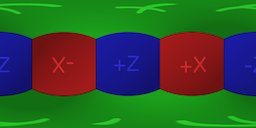

# CubemapToEquirectangular
A Unity3D plugin for converting panoramas in cubemap format to equirectangular format.

Two options are available:
- CPU based conversion of `Texture2D` implemented in C#
- GPU based conversion of `Cubemap` implemented in HLSL

## How it works

Assuming the input image is in the following cubemap format:

The goal is to project the image to the equirectangular format like so:

The conversion algorithm is rather straightforward. In order to calculate the best estimate of the color at each pixel in the equirectangular image given a cubemap with 6 faces:

- Firstly, calculate polar coordinates that correspond to each pixel in the spherical image.
- Secondly, using the polar coordinates form a vector and determine on which face of the cubemap and which pixel of that face the vector lies; just like a raycast from the center of a cube would hit one of its sides and a specific point on that side.

Keep in mind that there are multiple methods to estimate the color of a pixel in the equirectangular image given a normalized coordinate (u,v) on a specific face of a cubemap. The most basic method, which is a very raw approximation and is used in this plugin, is to round the coordinates to a specific pixel and use that pixel.

The implementation of the algorithm will vary depending on the context. An easy to understand (but slow) implementation of this algorithm that runs on the CPU is [here](Assets/Scripts/CubemapConverter.cs). A faster implementation that runs on the GPU is [here](Assets/Shaders/CubemapToEquirectangular.shader).

## Limitations and potential improvements
The C# implementation runs on the CPU and is not going to be fast. It's usefulness is limited when conversion must happen in real time. It also requires the input cubemap to be a `Texture2D`.

The HLSL implementation requires a `Cubemap` which has resolution constraints. It's usefulness is limited in scenarios when a high resolution input image must be converted.

Furthermore, the quality of the resulting images can be greatly improved by either employing a more sophisticated method to estimate the color of a pixel during the conversion or by post processing the resulting image (or both, actually). For example, an image of bigger size could be generated, a blur filter applied and then downsampled back to the desired resolution.

## Note
This plugin was originally created as a supplement to my StackOverflow answer available [here](https://stackoverflow.com/a/34427087/1531778).